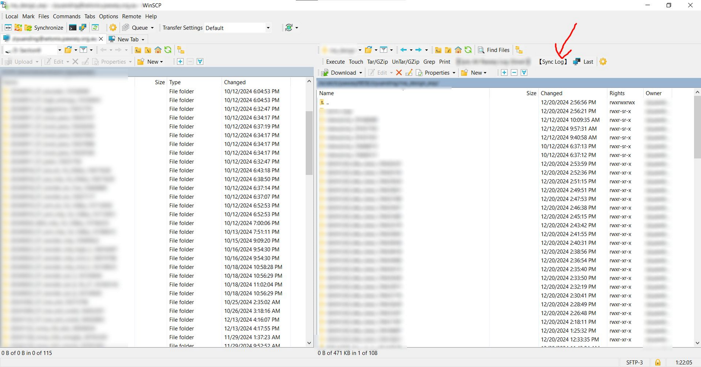

rsync是一个好用的文件传输工具。对我来说，它比scp好的一点是，它可以解析远程机器中软链接里的内容，并在下载到本地时抹平了软链接。

我本地机器使用的是Windows操作系统，需要安装cwRsync，Linux系统则正常安装rsync就行（多半发行版已经自带了）:

```
scoop install main/cwrsync
```

如果你习惯于直接用命令行，那么便可以直接执行：

```
rsync -avzL -e "ssh -i ~/.ssh/id_ed25519"  <远程机器用户名>@<远程机器地址>:<远程文件路径>  <本地路径>
```

这里用到了ssh来登录远程机器，如果你用的是Windows系统，默认使用的是自带的openSSH，多半会报错：
```
rsync: connection unexpectedly closed (0 bytes received so far) [receiver] 
```

来自 <https://stackoverflow.com/questions/7261029/why-is-this-rsync-connection-unexpectedly-closed-on-windows> 

很有可能是ssh的问题，我在Windows上最终使用的命令是这样的，用的cwRsync自带的ssh：
```
rsync -avzL -e "~\scoop\apps\cwRsync\6.3.2\bin\ssh.exe -i ~/.ssh/id_ed25519"  <远程机器用户名>@<远程机器地址>:<远程文件路径>  <本地路径>
```


我还希望能在WinSCP里操作。WinSCP是一个文件传输的GUI。我希望我能点选一个文件夹，然后点击一个自定义按钮来执行我上面写的rsync命令。

最终写出来的是这样的，我不知道为什么winscp必须要经过cmd才能用其他命令，直接用rsync不被识别。

```
cmd /c "D: && cd / &&  rsync -avzL -e '~\scoop\apps\cwRsync\6.3.2\bin\ssh.exe -i ~/.ssh/id_ed25519'  <远程机器用户名>@<远程机器地址>:!/!& '<本地相对于D盘根目录的路径>'  --log-file='<本地相对于D盘根目录的路径>/rsync.log'"
```


解释一下:
- D: 切换盘符
- cd / 切到D盘的根目录。直接切换盘符并不一定移动到根目录（而是上次所在的目录）。
- --log-file=xxx   rsync的传输日志，调试用。
- !/!&  选中的远程目录路径，这个是WinSCP的自己的定义

WinSCP自定义命令的时候，勾选“本地命令 Local command”和“使用远程文件 Use remote files”

最终效果：

